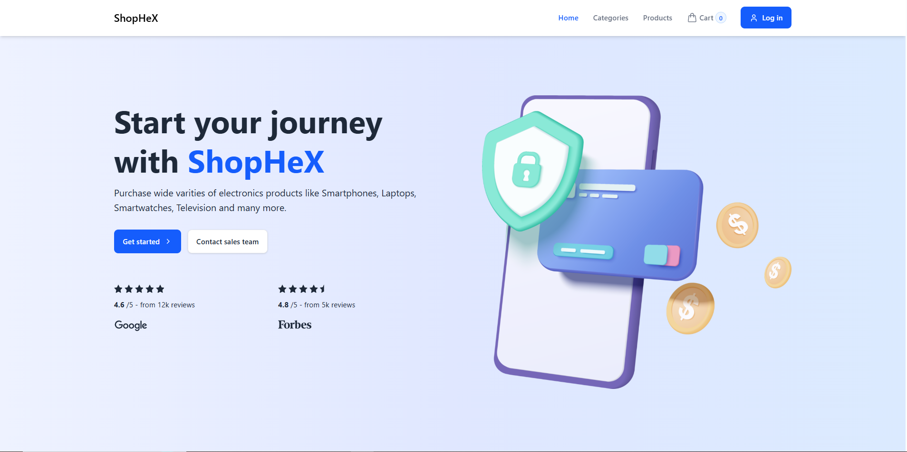
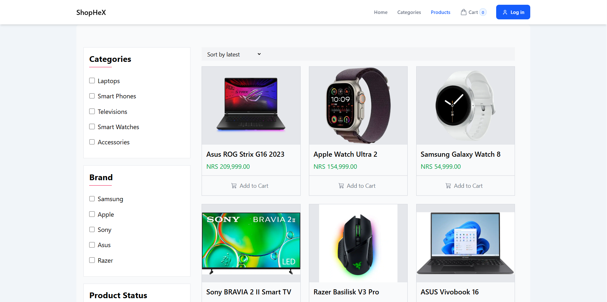
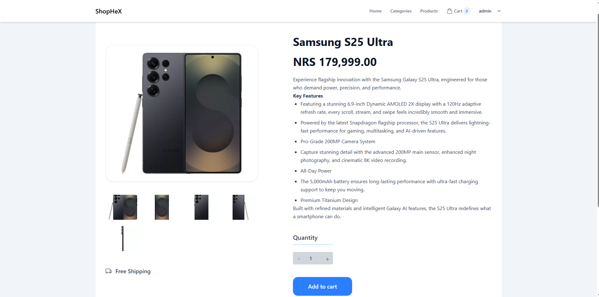
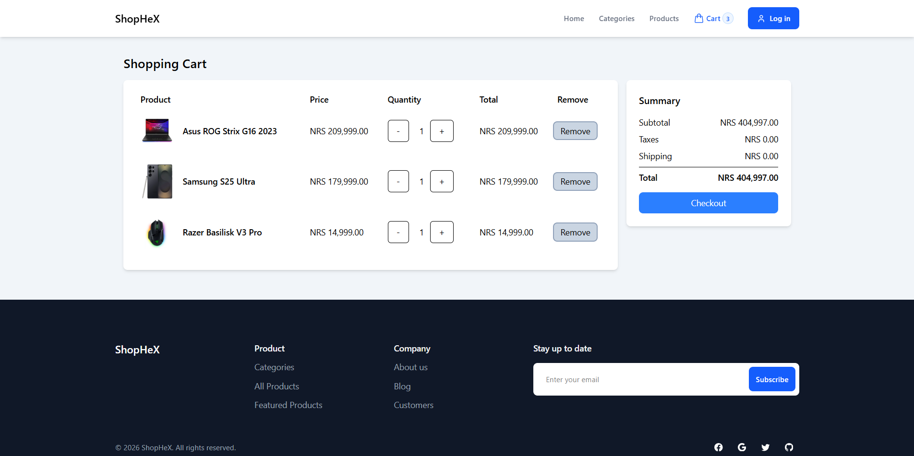
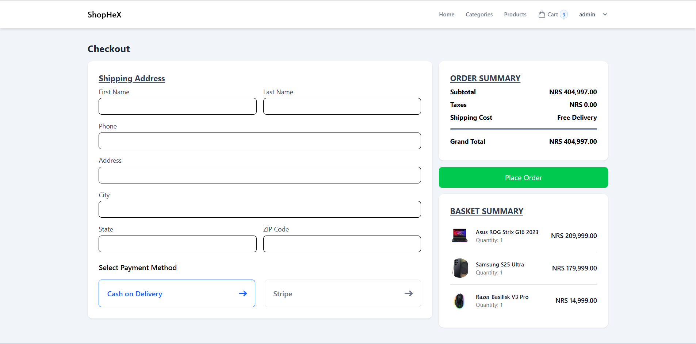
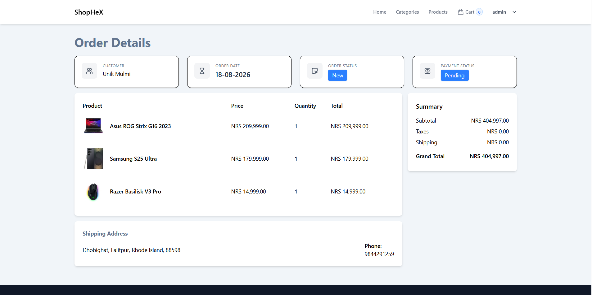
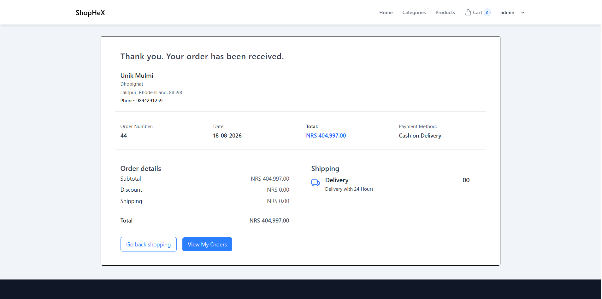
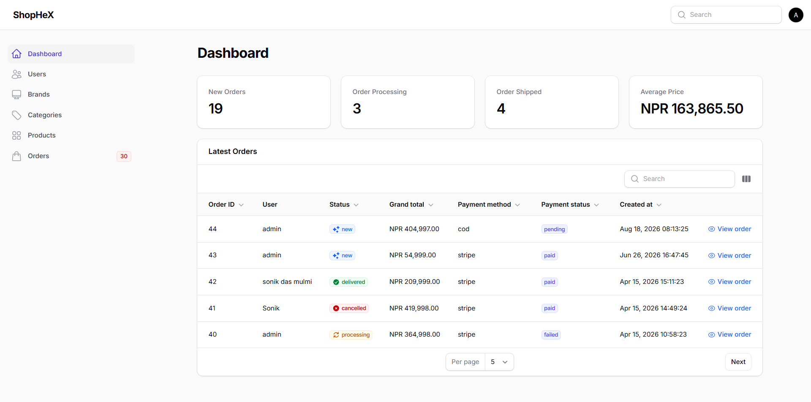
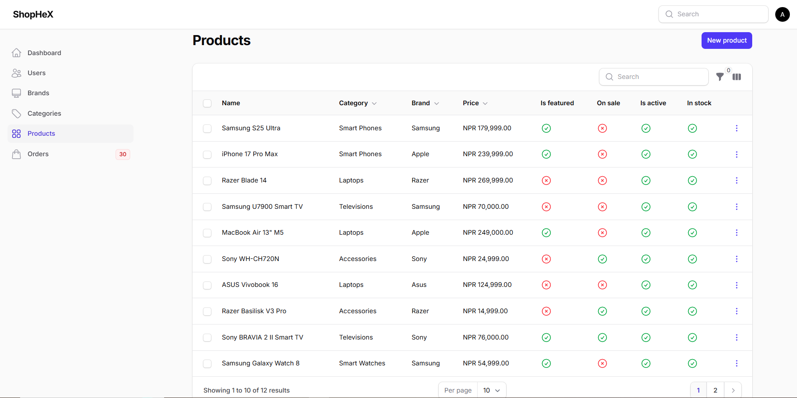

# ShopHeX

A full-stack e-commerce web application built with **Laravel 12, Livewire, Tailwind CSS, and Filament**.

ShopHeX provides a complete online shopping experience with product browsing, filtering, cart management, checkout, Stripe payments, Cash on Delivery, and order tracking. It also includes a Filament-powered admin panel for managing products, categories, brands, customers, and orders.


## Features

### Customer Features

* User registration, login, and password reset
* Browse products by category and brand
* Filter products by price, featured, and sale status
* Sort products by latest and price
* Product detail pages with quantity selection
* Cookie-based shopping cart
* Add, remove, and update cart items
* Checkout with shipping information
* Stripe card payments
* Cash on Delivery
* Order confirmation emails
* View order history and order details

### Admin Features

* Product, category, and brand management
* Multiple product image uploads
* Product stock, sale, featured, and active status controls
* Customer management
* Order management and status tracking
* Payment status management
* Shipping address management
* Order statistics
* Latest orders dashboard

## Tech Stack

| Category                    | Technologies                    |
| --------------------------- | ------------------------------- |
| **Backend**                 | PHP 8.2+, Laravel 12            |
| **Frontend**                | Blade, Livewire, Tailwind CSS 4 |
| **Admin Panel**             | Filament 5                      |
| **Database**                | MySQL                           |
| **Authentication**          | Laravel Authentication          |
| **Payments**                | Stripe, Cash on Delivery        |
| **Email**                   | Laravel Mail                    |
| **JavaScript / Build Tool** | Vite                            |
| **UI Notifications**        | Livewire Alert                  |
| **Package Management**      | Composer, npm                   |

## Screenshots

### Customer Interface















### Admin Panel





## Installation

Follow these steps to run the project locally.

### 1. Clone the repository

```bash
git clone https://github.com/YOUR_USERNAME/shophex.git
cd shophex
```

### 2. Install PHP dependencies

```bash
composer install
```

### 3. Install frontend dependencies

```bash
npm install
```

### 4. Create the environment file

**Windows Command Prompt:**

```cmd
copy .env.example .env
```

**Windows PowerShell:**

```powershell
Copy-Item .env.example .env
```

**macOS / Linux:**

```bash
cp .env.example .env
```

### 5. Generate the application key

```bash
php artisan key:generate
```

### 6. Configure the database

Update the database settings in your `.env` file:

```env
APP_NAME="ShopHeX"
APP_ENV=local
APP_DEBUG=true
APP_URL=http://127.0.0.1:8000

DB_CONNECTION=mysql
DB_HOST=127.0.0.1
DB_PORT=3306
DB_DATABASE=your_database_name
DB_USERNAME=your_database_username
DB_PASSWORD=your_database_password
```

Create the MySQL database before running the migrations.

### 7. Run database migrations and seeders

```bash
php artisan migrate
php artisan db:seed
```

The seeders populate the database with the required initial data.

### 8. Create the storage link

```bash
php artisan storage:link
```

This allows uploaded product images and other public files to be accessed through the application.

### 9. Configure Stripe Payments

Add your Stripe credentials to the `.env` file:

```env
STRIPE_KEY=your_stripe_publishable_key
STRIPE_SECRET=your_stripe_secret_key
```

You can use your Stripe test-mode credentials for local development.

### 10. Configure Mail

ShopHeX uses Laravel Mail for order confirmation emails.

Add your mail provider credentials to the `.env` file:

```env
MAIL_MAILER=smtp
MAIL_HOST=your_mail_host
MAIL_PORT=587
MAIL_USERNAME=your_mail_username
MAIL_PASSWORD=your_mail_password
MAIL_ENCRYPTION=tls
MAIL_FROM_ADDRESS="hello@shophex.test"
MAIL_FROM_NAME="${APP_NAME}"
```

For local testing without a real mail provider, you can use the log mailer:

```env
MAIL_MAILER=log
```

Emails will then be written to:

```text
storage/logs/laravel.log
```

Alternatively, you can use a service such as Mailtrap for testing.

### 11. Start the development server

Open **two terminals**.

**Terminal 1:**

```bash
php artisan serve
```

**Terminal 2:**

```bash
npm run dev
```

### 12. Visit the application

Open your browser and navigate to:

```text
http://127.0.0.1:8000
```

## Admin Panel

The Filament admin panel is available at:

```text
http://127.0.0.1:8000/admin
```

### Default Admin Credentials

If the database seeders are used, the default admin credentials are:

```text
Email: admin@shophex.test
Password: password
```

**Change these credentials before deploying the application to a production environment.**

## Project Structure

```text
app/
├── Filament/
├── Livewire/
├── Mail/
├── Models/
└── ...

database/
├── migrations/
├── factories/
└── seeders/

resources/
├── views/
└── ...

routes/
└── web.php
```

## Future Improvements

* Product reviews and ratings
* Wishlist functionality
* Discount and coupon system
* Advanced analytics
* Additional payment gateways

## License

This project is built as an internship deliverable and portfolio showcase. Not for commercial redistribution without explicit permis
